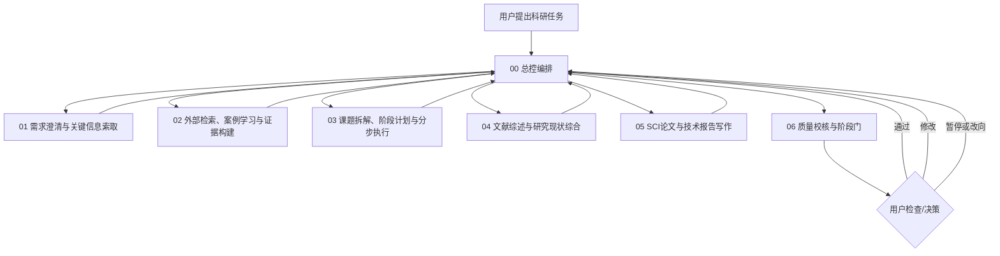

# 科研 Agent Skills 协同套件 v2.0

本套件不是若干彼此独立的提示词，而是一套由**总控 Skill 统一编排、功能 Skill 分阶段执行、质量门 Skill 回收验收**的科研工作系统。

## 一、核心架构



总控 Skill 是唯一默认入口和阶段返回点。功能 Skill 不自行把项目推进到底，每完成一个阶段都必须提交统一的“阶段交接包”，再由总控调用质量门进行检查。

## 二、目录说明

| 目录 | 功能 |
|---|---|
| `00-research-orchestrator` | 接收任务、管理状态、拆解分工、调用其他 Skill、组织用户验收 |
| `01-requirement-elicitation` | 主动提问、索要关键信息、减少错误假设 |
| `02-research-reconnaissance` | 联网检索、学习相似项目、建立证据链、提炼可迁移做法 |
| `03-stage-planning-execution` | 根据任务复杂度和风险动态拆分阶段，并控制一次只完成一个可验收工作包 |
| `04-literature-review` | 文献检索策略、文献矩阵、主题综合、研究缺口与综述写作 |
| `05-academic-writing` | SCI 小论文、课程论文、技术报告、项目总结等成果写作 |
| `06-quality-gate` | 独立审查、阶段评分、问题分级、通过/返工/阻断决策 |
| `shared` | 项目状态、交接包、质量标准、路由案例等公共模板 |
| `evals` | 用于测试整套 Skill 是否按预期触发和协同的案例 |

## 三、推荐用法

### 1. 新任务必须从总控开始

可直接输入：

> 调用科研项目总控 Skill。我要完成【任务】。先不要直接生成最终成果，请先检查已有信息、主动检索能够自行查明的内容，再向我询问真正影响方案质量的关键信息；随后根据任务复杂度、风险、交付物和验证需求动态拆分阶段，经我确认后逐步执行。每阶段完成后进行质量校核并让我确认，再进入下一阶段。

### 2. 默认运行模式

- **标准模式（默认）**：3–7 个高价值问题；阶段数量根据复杂度、风险和交付物动态确定；关键节点由用户确认。简单任务可少于 3 个阶段，常规复杂任务通常可采用 3–5 个阶段，高复杂度任务可超过 5 个阶段。
- **快速模式**：只问阻断性问题；阶段数量按任务风险动态确定；适合低风险、短任务。
- **严格模式**：建立完整检索记录、证据矩阵和质量评分；每个阶段均需用户确认，适合 SCI 论文、项目申报、正式报告。

### 3. 中断后恢复

把 `shared/PROJECT_STATE.template.md` 的最新内容交给总控，并说明：

> 根据该项目状态恢复任务。先核对已完成内容和未决问题，不要重复已完成工作。

## 四、协同原则

1. **能检索的不问用户**：公开事实、标准、论文方法和相似案例先自行搜索。
2. **必须由用户决定的才提问**：研究边界、目标期刊、核心偏好、是否采用某项技术路线。
3. **不一口气完成大任务**：一次只处理一个有明确输入、输出和验收标准的工作包。
4. **证据与推断分开**：明确区分资料事实、模型推断、工程建议和用户决策。
5. **每阶段必须回总控**：功能 Skill 不得自行跨越质量门。
6. **按需加载**：总控只加载当前需要的 Skill 和参考文件，避免反复灌入完整上下文。
7. **形成可追溯状态**：重要决策、参数来源、假设、版本和待办必须写入项目状态。
8. **不伪造**：不得编造文献、参数、数据、仿真结果、标准条款或已完成的操作。

## 五、推荐安装结构

```text
research-agent-skills/
├── AGENTS.md
├── README.md
├── SKILL.md
├── 00-research-orchestrator/SKILL.md
├── 01-requirement-elicitation/SKILL.md
├── 02-research-reconnaissance/SKILL.md
├── 03-stage-planning-execution/SKILL.md
├── 04-literature-review/SKILL.md
├── 05-academic-writing/SKILL.md
├── 06-quality-gate/SKILL.md
├── shared/
│   ├── PROJECT_STATE.template.md
│   ├── STAGE_HANDOFF.template.md
│   ├── QUALITY_RUBRIC.md
│   └── ROUTING_EXAMPLES.md
└── evals/evals.json
```

## 六、版本说明

v2.0 相比上一版的核心变化：

- 从单一大 Skill 改为“1 个总控 + 6 个功能 Skill”。
- 明确总控为唯一用户接口和最终决策者。
- 增加强制联网学习和相似项目迁移机制。
- 增加阶段交接包与项目状态文件。
- 增加用户参与的阶段门，不允许大任务一次性生成到底。
- 增加 Skill 测试案例，便于后续迭代。

## 应用版模型与工具路由

Windows 版 ChatGPT 桌面应用是本项目的主要入口。项目用 `.codex/config.toml` 限制子代理并发/深度，并用 `.codex/agents/research-support.toml` 与 `.codex/agents/research-output.toml` 定义支持和低风险输出代理。实际模型映射、回退条件、工具边界和自检命令见 `shared/MODEL_ROUTING.md`；现有 CMD/PowerShell 启动器保留，但不承担应用版模型路由。
