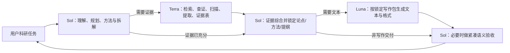

# 科研工作流 Skills 集成包

本仓库提供一条统一科研流程，由总控自动选择功能 Skills 和 Sol/Terra/Luna 责任。它不是独立 AI-Agent Runtime，也不要求用户选择模型、Agent 或工作模式。

## 核心流程



| 模型 | 自动责任 | 明确边界 |
|---|---|---|
| GPT-5.6 Sol | 需求、总体规划、任务拆解、方法、证据综合、关键判断、最终答复 | 不把最终科研责任委派出去 |
| GPT-5.6 Terra | 文献检索、网页查证、文件扫描、信息提取、证据表和来源完整性 | 不决定研究方向、方法、参数、来源可靠性或最终结论 |
| GPT-5.6 Luna | 根据锁定提纲、论点、证据编号和格式要求生成文本、语言和格式 | 不新增事实、引用、公式、因果关系或科研判断 |

## 功能 Skills

- `00-research-orchestrator`：统一入口、自动路由和最终综合；
- `01-requirement-elicitation`：高影响需求、边界和成功标准；
- `02-research-reconnaissance`：外部检索、资料查证和模式学习；
- `03-stage-planning-execution`：仅在真实依赖存在时形成紧凑任务卡；
- `04-literature-review`：文献矩阵、主题综合和研究缺口；
- `05-academic-writing`：基于锁定论点和证据包完成科研写作；
- `06-quality-gate`：确定性、证据完整性和 Sol 语义验收。
- `07-code-context`：为科研软件、仿真与数据流水线提供可选 CodeGraph 检索、紧凑代码上下文胶囊和原生工具回退。

## 紧凑上下文

模型之间不复制完整对话、全部项目历史、全部工具日志或整篇论文原文。

### Sol → Terra

- 当前唯一目标；
- 输入文件、页面、URL 或数据表定位；
- 已锁定边界；
- 证据表字段和来源要求；
- 验收与停止条件。

### Terra → Sol

- 证据表或提取结果；
- 来源定位和元数据；
- 可观察事实摘要；
- 冲突、缺口和不确定项。

### Sol → Luna

- 目标章节或交付物；
- 锁定提纲和论点顺序；
- 允许使用的事实、数据、公式和引用编号；
- 风格、语言、长度和格式；
- 禁止新增项与占位符规则。

### Luna → Sol

- 完整草稿或格式结果；
- 占位符和不确定项；
- 使用的证据定位；
- 建议 Sol 检查的下一动作。

交接结构见 `shared/STAGE_HANDOFF.template.md` 和 `shared/STAGE_HANDOFF.schema.json`。

## 可选科研代码上下文

当科研任务需要理解本地多文件代码库的调用链、数据流、复现路径或改动影响时，总控可按需调用 `07-code-context`：

- CodeGraph MCP 已配置且项目已索引：优先一次有界 `codegraph_explore`；
- 工具缺失、无索引、结果过宽或存在陈旧提示：回退 `rg`、定点读取和已有测试；
- 只向 Sol 返回代码定位、关系摘要、静态分析限制和验证目标，不返回完整工具输出；
- 不自动安装或初始化 CodeGraph，不改变 Agent 配置，不启用遥测；
- 关键方法、参数、数据转换和科学结论仍需精确源码或测试验证。

CodeGraph 只可能降低代码探索 Token，不能替代文献、PDF、实验数据或论文证据预算。任何节省比例都必须通过目标仓库的有/无索引对照评测后再报告。


## 质量检查

检查强度由总控内部自动选择：

- L0：语法、Schema、哈希、文件、单位和确定性测试；
- L1：Terra 核对来源定位、字段完整性、证据覆盖、遗漏和冲突；
- L2：Sol 裁决来源可靠性、方法、参数、解释和科学结论。

投稿/申报、安全或高成本、关键参数、核心方法和最终科学结论自动执行 L2。Sol 只做一次紧凑验收，不重新写全文。

## 何时分阶段

只有后续工作确实依赖当前证据、数据、参数、用户决定或实验/仿真结果时才创建阶段。简单问答、一次官网核验、已锁定内容写作和单一文件修改不制造项目计划。

## 项目级模型路由

Windows Codex 应用通过以下文件自动路由：

- `.codex/config.toml`：固定 Sol/`xhigh`、启用 multi-agent、注册 Terra/Luna 角色，并限制 `max_threads=2`、`max_depth=1`；
- `.codex/agents/research-support.toml`：Terra 只读证据 Worker；
- `.codex/agents/research-output.toml`：Luna 只读写作 Worker；
- `shared/MODEL_ROUTING.json`：唯一 canonical 模型映射。

Worker 不递归委派，也不互相转交。Terra/Luna 不可用时进入 Sol-only，不替换为未经验证的模型。

## 使用

在科研项目中调用：

> 调用科研项目总控 Skill。请按统一科研流程处理【任务】。只询问真正阻断且必须由我决定的问题；是否检索、调用哪个功能 Skill、是否分阶段和是否需要严格验收由总控自动判断。

项目模板可由：

```powershell
powershell -NoProfile -ExecutionPolicy Bypass -File .\scripts\New-ResearchProject.ps1
```

创建。项目特殊规则写入 `PROJECT_OVERRIDES.md`，不要修改公共 Skill。

## 验证

最小应用路由检查：

```powershell
powershell -NoProfile -ExecutionPolicy Bypass -File .\scripts\Test-ResearchAppRouting.ps1 -AllowUnverifiedModelCatalog
```

全量静态与集成检查：

```powershell
powershell -NoProfile -ExecutionPolicy Bypass -File .\scripts\Test-ResearchSkills.ps1
```

离线检查可以显式使用 `-AllowUnverifiedModelCatalog`；正式发布验收不得使用该开关。

## 版本状态

`VERSION` 仍保持 `2.1.0`。统一工作流重构当前位于 Unreleased，尚未打 `v2.2.0` 标签。早期 WP5 A/B 未证明旧的多路线/Runtime 方案有质量或效率收益，因此只保留精简诊断记录，不作为发布依据。
