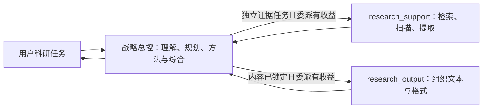

# 科研工作流 Skills 集成包

本仓库提供一条统一科研流程。用户可在启动新任务前选择总控与两个 Worker 的模型；总控仍按任务自动选择功能 Skills、委派和检查强度。

## 核心流程


```mermaid
flowchart LR
    U["用户科研任务"] --> C["战略总控：理解、规划、方法与综合"]
    C -->|独立证据任务且委派有收益| E["research_support：检索、扫描、提取"]
    E --> C
    C -->|内容已锁定且委派有收益| O["research_output：组织文本与格式"]
    O --> C
    C --> U
```

| 角色 | 默认模型 | 可选模型 | 责任 |
|---|---|---|---|
| 战略总控 | GPT-5.6 Sol / `xhigh` | GPT-6 Astra、GPT-5.6 Sol | 规划、方法、证据综合、关键判断和最终答复 |
| `research_support` | GPT-5.6 Terra / `medium` | Sol、Terra、Luna | 有界检索、扫描、提取和证据表 |
| `research_output` | GPT-5.6 Luna / `low` | Sol、Terra、Luna | 根据锁定输出包组织文本、表格、语言和格式 |

## 功能 Skills

- `00-research-orchestrator`：统一入口、自动路由和最终综合；
- `01-requirement-elicitation`：高影响需求、边界和成功标准；
- `02-research-reconnaissance`：外部检索、资料查证和模式学习；
- `03-stage-planning-execution`：仅在真实依赖存在时形成紧凑任务卡；
- `04-literature-review`：文献矩阵、主题综合和研究缺口；
- `05-academic-writing`：基于锁定论点和证据包完成科研写作；
- `06-quality-gate`：确定性、证据完整性和 Sol 语义验收。
- `07-code-context`：为科研软件、仿真与数据流水线提供可选 CodeGraph 检索、紧凑代码上下文胶囊和原生工具回退。

## 紧凑上下文

模型之间不复制完整对话、全部项目历史、全部工具日志或整篇论文原文。

### 战略总控 → research_support

- 当前唯一目标；
- 输入文件、页面、URL 或数据表定位；
- 已锁定边界；
- 证据表字段和来源要求；
- 验收与停止条件。

### research_support → 战略总控

- 证据表或提取结果；
- 来源定位和元数据；
- 可观察事实摘要；
- 冲突、缺口和不确定项。

### 战略总控 → research_output

- 一个主要交付物；
- 锁定内容、字段、顺序、提纲、论点和模板；
- 允许使用的事实、数据、公式和引用编号；
- 风格、语言、长度、版式和格式；
- 禁止新增项、确定性验收条件与占位符规则。

### research_output → 战略总控

- 完整草稿、结构化内容或格式规格；
- 占位符和不确定项；
- 使用的证据定位；
- 建议 Sol 检查的下一动作。

交接结构见 `shared/STAGE_HANDOFF.template.md` 和 `shared/STAGE_HANDOFF.schema.json`。

### 上下文效率协议

多来源、多文件、长日志、跨阶段或正式写作任务按需加载 `shared/CONTEXT_EFFICIENCY_PROTOCOL.md`：

- 按“已有定位 → 元数据/提纲 → 精确片段/符号 → 必要关系邻域 → 有理由的全文”逐级获取；
- 通过任务内上下文账本区分 new、reused、changed 和 omitted，避免未变化内容重复交付；
- 长材料采用可逆省略，保留恢复定位、覆盖范围、未覆盖范围和验证触发条件；
- 公式、单位、数值、工况、参数、异常和直接支撑结论的证据属于科研无损区；
- 科研代码修改先判断无需新增、复用项目能力、标准库/平台能力和既有依赖，最后才写最小新实现。

本协议吸收符号级检索、重复交付控制、可恢复压缩和最小实现等通用原则，但不安装 Headroom、jCodeMunch、Ponytail 或 CodeGraphContext，也不复制其运行时和自报性能数字。

### 变更完整性协议

修改 Skill、代码、脚本、Schema、配置、模板、说明或测试并影响多个活动文件时，加载 `shared/CHANGE_INTEGRITY_PROTOCOL.md`。它要求先定位根因和唯一权威来源，让 generated 与 consumer 通过生成或解析式测试保持一致；同时保留原始数据、失败记录、决策依据、复盘和版本历史。该协议是共享变更契约，不是新的 Agent 或工作流层。

### 主动提问与科研记忆演化

`shared/PROACTIVE_INQUIRY_AND_MEMORY_PROTOCOL.md` 统一两件事：任务中先检查材料和权威公开信息，再只询问用户独有的高影响决定；项目收尾时由战略总控主动形成分级候选摘要，再询问用户批准全部、指定子集、拒绝或延后。A/B 级重要原则与工作流详细保留，C/D 级经验压缩为关键步骤或仅留项目内。重复出现不会自动晋升，用户未回复也不会写入个人全局记忆。

## 可选科研代码上下文

当科研任务需要理解本地多文件代码库的调用链、数据流、复现路径或改动影响时，总控可按需调用 `07-code-context`：

- CodeGraph MCP 已配置且项目已索引：优先一次有界 `codegraph_explore`；
- 工具缺失、无索引、结果过宽或存在陈旧提示：回退 `rg`、定点读取和已有测试；
- 只向 Sol 返回代码定位、关系摘要、静态分析限制和验证目标，不返回完整工具输出；
- 不自动安装或初始化 CodeGraph，不改变 Agent 配置，不启用遥测；
- 关键方法、参数、数据转换和科学结论仍需精确源码或测试验证。

CodeGraph 只可能降低代码探索 Token，不能替代文献、PDF、实验数据或论文证据预算。任何节省比例都必须通过目标仓库的有/无索引对照评测后再报告。


## 质量检查

检查强度由总控按风险选择：

- L0：语法、Schema、哈希、文件、单位和确定性测试；
- L1：证据 Worker 核对来源定位、字段完整性、证据覆盖、遗漏和冲突；
- L2：战略总控裁决来源可靠性、方法、参数、解释和科学结论。

投稿/申报、安全或高成本、关键参数、核心方法和最终科学结论执行 L2。战略总控只做一次紧凑验收。

## 何时分阶段

只有后续工作确实依赖当前证据、数据、参数、用户决定或实验/仿真结果时才创建阶段。简单问答、一次官网核验、已锁定内容写作和单一文件修改不制造项目计划。

## 项目级模型路由

Windows Codex 应用通过以下文件解析路由：

- `shared/MODEL_ROUTING.json`：公共默认值、安全边界与委派契约；
- `.research-agent/MODEL_ROUTING.selection.json`：项目自己的模型与 reasoning 选择；
- `.codex/config.toml`：新任务的战略总控模型；
- `.codex/agents/research-support.toml` 与 `research-output.toml`：两个只读 Worker。

在项目根目录双击 `配置科研模型.cmd`，或运行：

```powershell
powershell -NoProfile -ExecutionPolicy Bypass -File .\scripts\Set-ResearchModels.ps1 -ProjectDirectory '项目路径' -Interactive
```

默认保持 Sol/`xhigh`、Terra/`medium`、Luna/`low`。模型选择对之后启动的新任务生效；已运行的主线程不会动态换模型。选择脚本会先保存配置，再通过 `codex debug models` 校验当前运行时。当前模型目录缺少 Astra 时会记录 `blocked_model_catalog`，升级运行时或改回 Sol 后即可启动。Worker 不递归委派，也不互相转交。

## 使用

在科研项目中调用：

> 调用科研项目总控 Skill。请按统一科研流程处理【任务】。只询问真正阻断且必须由我决定的问题；是否检索、调用哪个功能 Skill、是否分阶段和是否需要严格验收由总控自动判断。

### 个人科研工作区（推荐）

先初始化一个私人的科研工作区，再由脚本自动分配 `project-编号-项目名`：

```powershell
powershell -NoProfile -ExecutionPolicy Bypass -File .\scripts\Initialize-ResearchWorkspace.ps1 -WorkspaceRoot 'D:\ResearchWorkspace'
powershell -NoProfile -ExecutionPolicy Bypass -File .\scripts\New-ResearchProject.ps1 -ProjectName '氨燃料供给系统' -WorkspaceRoot 'D:\ResearchWorkspace'
```

工作区包含：

- `RESEARCH_WORKBENCH.md`：经确认的稳定工作偏好；
- `GLOBAL_LESSONS.md`：经确认、可跨项目复用的去敏经验；
- `PROJECT_SOP.md`：项目创建、执行和收尾规范；
- `PROJECT_INDEX.json`：项目编号和状态索引；
- 每个项目自己的 `08_质量门与复盘/PROJECT_RETROSPECTIVE.md`。

项目经验默认只留在项目内。项目收尾时 Sol 会先主动生成带证据和边界的分级候选摘要，再询问批准全部、指定编号、拒绝或延后；只有明确批准的条目才能写入个人全局记忆，公共 Skill 修改还需要回归测试。

### 同一路由的目录级入口（兼容）

不使用个人工作区时仍可直接指定目标目录。该入口生成相同的项目路由快照、Agent 配置和项目模板，属于同一 canonical 流程的替代初始化方式，不是第二套工作流；当前没有单独弃用时间表。

```powershell
powershell -NoProfile -ExecutionPolicy Bypass -File .\scripts\New-ResearchProject.ps1 -ProjectName '项目名' -Destination 'D:\ResearchProjects'
```

项目特殊规则写入 `PROJECT_OVERRIDES.md`，不要修改公共 Skill。
启动器的 `scripts/research-launcher-settings.json` 是本机运行状态，首次启动时自动创建且不进入 Git；仓库只提供不含真实路径的 `.example.json`。

## 历史更新目录

每次实质性优化在 [update-history](update-history/README.md) 中建立独立记录，说明背景与根因、具体改动、兼容与数据保护、验证证据以及 Git/PR 追溯。`CHANGELOG.md` 保留版本级摘要，历史目录提供逐次优化明细。

## 项目更新记录

这里按时间倒序介绍每次版本更新带来的实际改进，让用户不离开项目首页就能了解演进方向。更完整的逐项技术变更见 [CHANGELOG.md](CHANGELOG.md)。

| 日期 | 版本 / 状态 | 主要改进 |
|---|---|---|
| 2026-08-05 | `v2.4.0` 开发中 | 新增主动关键信息获取与科研记忆演化：先查后问、重要经验详细/次要经验简要、重复经验精炼、收尾主动候选摘要、选择性授权和用户记忆控制。 |
| 2026-08-04 | `v2.3.0` 开发中 | 增加投稿论断追溯闭环：先锁定核心命题、贡献、证据缺口与声明边界，再把主要结果映射回贡献和证据条件；投稿前复用质量门发现关闭 CRITICAL / MAJOR 异议，普通内部报告不受影响。 |
| 2026-08-03 | `v2.3.0` 开发中 | 统一科研流程与 Sol/Terra/Luna 职责；增加个人科研工作区、项目复盘与经验晋升；引入可逆上下文压缩和科研无损区；将模型路由收敛到唯一权威来源；Schema 自动拒绝违规只读 handoff；增加原生一致性、历史追溯和路由漂移回归测试。 |
| 2026-07-16 | `v2.1.0` | 增加 Windows 一键启动器、桌面快捷方式和项目感知启动；建立 canonical 模型路由快照、哈希校验、L0/L1/L2 质量门与安全降级；补齐安装、同步、备份和项目创建的端到端测试。 |
| 2026-07-10 | `v2.0.0` | 建立正式源仓库与版本化开发规范；提供安装、同步、检查、备份和新建科研项目脚本；加入科研项目模板与 Skill 运行复盘模板。 |

### 2026-08-05 · `v2.4.0` 开发中

- **主动获取关键信息**：先检查项目材料和权威公开来源，只问会改变路线且必须由用户决定的问题。
- **分级记忆精度**：重要原则和稳定工作流详细记录，低影响经验只保留关键步骤，项目特例不进入全局记忆。
- **收尾主动确认**：Sol 先给出候选摘要，再允许用户批准全部、指定子集、拒绝或延后；未回复不写入。
- **减少重复沟通**：反复出现的习惯会被合并、精炼并主动确认，但不会按次数自动晋升。

### 2026-08-04 · `v2.3.0` 开发中

- **贡献先锁定**：投稿级成果在实质写作前确认核心命题、可检验贡献、所需 / 已有 / 缺失证据及声明边界。
- **结果能反向追溯**：每个主要 Results 单元映射到贡献 ID、证据定位、工况、样本、单位、不确定性和允许 / 禁止解释。
- **投稿风险可关闭**：复用 L1/L2 发现形成审稿与编辑风险登记；影响科学有效性的 CRITICAL / MAJOR 异议关闭前不宣布可投稿。
- **边界保持轻量**：只新增一个可选项目合同模板，不复制固定多阶段流程，不增加常驻 Reviewer Agent，内部周报和一般过程报告不强制使用。
- **外部模式学习**：以 clean-room 方式借鉴 [PaperSpine](https://github.com/WUBING2023/PaperSpine) 的贡献优先、结果—贡献映射和审稿视角预检思想；未复制其代码或完整工作流。

### 2026-08-03 · `v2.3.0` 开发中

- **工作流更统一**：不再让用户选择模式或模型，由 Sol 总控自动决定检索、写作、分阶段和验收强度。
- **科研过程更可恢复**：新增个人工作区、项目索引、项目复盘、证据定位和去敏经验晋升流程。
- **上下文更高效**：对长日志、论文和代码采用逐级获取与可逆省略，关键数值、单位、工况、异常和失败记录保持无损。
- **路由更稳定**：`shared/MODEL_ROUTING.json` 成为唯一权威来源，模板、配置和启动器由同步链生成或校验。
- **边界更可靠**：只读 Worker 的非空 `changed_files` 会被 Schema 直接拒绝，质量门输出统一为可机器判断的标准状态。
- **验证更严格**：新增负向 fixture、硬编码扫描、解析式漂移测试和行为评测；本轮候选版行为断言为 12/12，原版为 10/12。

### 2026-07-16 · `v2.1.0`

- 增加 Windows 一键启动、最近项目、桌面快捷方式和 Codex Desktop 图形界面入口。
- 建立 canonical 路由快照、SHA256 校验、模型目录预检以及 `ready / degraded_strategic_only / blocked_conflict` 状态。
- 增加复制安装、同步、ZIP 备份、Sol-only 降级和项目初始化等端到端回归测试。
- 修复中文编码、路径解析、模板重复创建、配置竞态覆盖和 PowerShell 语法误报等问题。

### 2026-07-10 · `v2.0.0`

- 建立唯一正式源仓库、版本文件、开发规范、候选修改与回归测试目录。
- 提供 Skills 安装、同步、检查、备份和科研项目创建脚本。
- 提供标准科研项目结构、项目模板和 Skill 运行复盘模板。

## 验证

最小应用路由检查：

```powershell
powershell -NoProfile -ExecutionPolicy Bypass -File .\scripts\Test-ResearchAppRouting.ps1 -AllowUnverifiedModelCatalog
```

全量静态与集成检查：

```powershell
powershell -NoProfile -ExecutionPolicy Bypass -File .\scripts\Test-ResearchSkills.ps1
```

离线检查可以显式使用 `-AllowUnverifiedModelCatalog`；正式发布验收不得使用该开关。

## 版本状态

`VERSION` 当前为 `2.4.0`。主动关键信息获取、分级科研记忆、统一工作流、科研工作区、可选代码上下文和共享上下文效率协议位于 Unreleased，尚未打 `v2.4.0` 标签。没有同任务、同输入、同验收标准的对照前，不报告固定 Token 节省比例。
